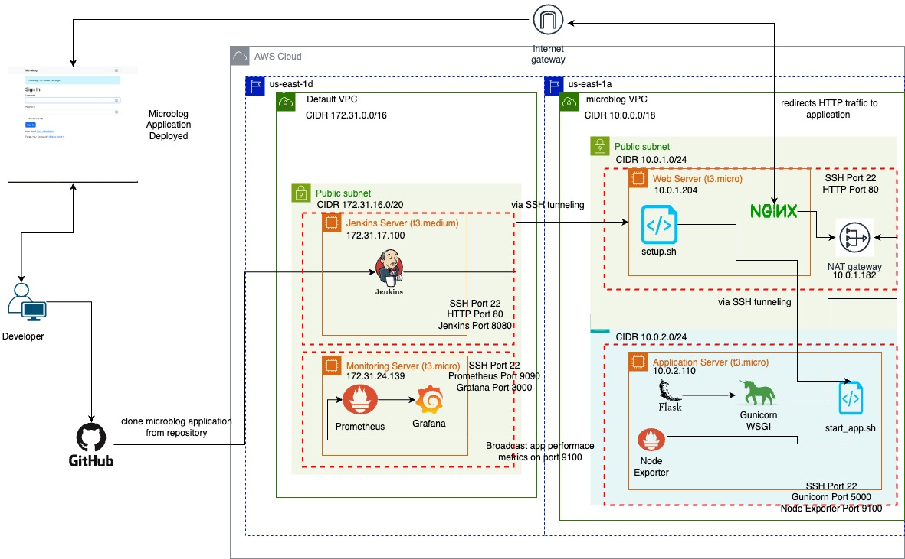

# Microblog VPC Deployment

## PURPOSE

The purpose of this workload is to provision and deploy a scalable and secure server infrastructure for the Microblog application. By setting up a custom Virtual Private Cloud (VPC) with distinct public and private subnets, and integrating Jenkins for continuous integration and deployment, I aimed to establish a robust environment that supports both development and production needs. Additionally, implementing monitoring tools like Prometheus and Grafana ensures that the system remains reliable and performant.

## STEPS

### 1. Repository Setup
I cloned the provided repository and renamed it to `microblog_VPC_deployment`.

Starting with a fresh repository ensures that all configurations and scripts are version-controlled and easily accessible for collaboration and future reference.

### 2. Creating a Custom VPC
In the AWS console, I created a custom VPC called microblogVPC `(CIDR 10.0.0.0/18)` with one Availability Zone `us-east-1a`, including a public subnet `(CIDR 10.0.1.0/24)` and a private subnet `(CIDR 10.0.1.0/24)`. I configured a NAT Gateway in one AZ and enabled DNS hostnames and resolution.

A custom VPC provides better control over network configurations, enhancing security and scalability. The public subnet hosts resources accessible from the internet, while the private subnet secures backend services. The NAT Gateway allows instances in the private subnet to access the internet without exposing them directly.

### 3. Configuring Public Subnet
I edited the settings of the public subnet to auto-assign public IPv4 addresses.

Automatically assigning public IPs ensures that instances launched in the public subnet can communicate with the internet, which is essential for services like the web server and Jenkins.

### 4. Setting Up Jenkins Server
I launched an EC2 `t3.medium` instance named "Jenkins" in the Default VPC and installed Jenkins. Jenkins automates the build, test, and deployment processes, streamlining the CI/CD pipeline and ensuring consistent application delivery. In its security group opened port 22 for SSH, port 80 for HTTP, and port 8080 using a custom TCP to access Jenkins UI.

### 5. Deploying Web Server
I created an EC2 `t3.micro` instance named "Web_Server" in the public subnet with a security group allowing ports 22 and 80. The web server serves as the entry point for users, handling HTTP requests. Opening ports 22 and 80 facilitates SSH access for management and HTTP traffic for web services.

### 6. Deploying Application Server
I launched an EC2 `t3.micro` instance named "Application_Server" in the private subnet with a security group allowing ports 22 and 5000. I generated and saved a key pair locally. The application server hosts the backend services. Restricting access to specific ports enhances security. Storing the key pair securely is crucial for SSH access.

### 7. Establishing SSH Connections
I generated SSH keys on the Jenkins server, appended the public key to the Web Server's `authorized_keys`, and tested the connection.Secure SSH access between servers is vital for automated deployments and management. Adding the Web Server to known hosts ensures trust and prevents man-in-the-middle attacks.

**Question:** *What does it mean to be a known host?*

**Answer:** A known host is a server that has been previously connected to and trusted by the client. When an SSH connection is established for the first time, the server's key is added to the client's `known_hosts` file, ensuring that future connections recognize and trust the server, preventing unauthorized access.

### 8. Configuring NginX on Web Server
I installed NginX on the Web Server, modified the `sites-enabled/default` file to proxy requests to the Application Server, verified the configuration, and restarted NginX. NginX acts as a reverse proxy, directing incoming traffic to the appropriate backend service. This setup enhances load balancing, security, and scalability.

### 9. Transferring Key Pair to Web Server
I copied the Application Server's key pair to the Web Server using scp. An example of this command looks like this:
`scp -i/path/to/.pem user@publicIP: /source/path/destination/path`

This facilitates secure SSH access from the Web Server to the Application Server, enabling seamless automated deployments and management.

### 10. Creating Deployment Scripts
I developed two bash scripts:
- `start_app.sh` for the Application Server to set up dependencies, clone the repository, install Python packages, set environment variables, and launch the application using Gunicorn. This Bash script automates the setup and deployment of a Python web application on a server. Here's a simple explanation of what it does:

1. **Install necessary packages**:
   - It installs Python 3.9, Python's package manager (pip), and tools for setting up a virtual environment.
   - It adds a software repository to the system to get Python updates (deadsnakes).
   - It installs other necessary tools, like Nginx (a web server) and Git (to download code from GitHub).

2. **Download the application code**:
   - It uses Git to download the web application code from a GitHub repository (`microblog_VPC_deployment`).
   - It navigates into the downloaded project folder.

3. **Set up a Python virtual environment**:
   - It creates an isolated Python environment so the app's dependencies don’t interfere with other system packages.
   - It activates the virtual environment, so future Python commands use this isolated setup.

4. **Install dependencies**:
   - It installs the libraries required by the application by reading a file called `requirements.txt`.
   - It also installs some additional libraries needed to run the app: Gunicorn (a Python web server), pymysql (for working with MySQL databases), and cryptography (for encryption).

5. **Set environment variables**:
   - It sets up an environment variable called `FLASK_APP` to tell Flask (a Python web framework) which file to run.

6. **Run Flask commands (optional)**:
   - It compiles translations for the application (for multilingual support).
   - It runs database migrations to ensure the database is set up correctly.

7. **Start the application**:
   - It starts the web application using Gunicorn, telling it to run on port 5000 with 4 worker processes, and runs it in the background.

8. **Display a confirmation message**:
   - The script prints a message indicating that the application is running.
-------------
- `setup.sh` for the Web Server to SSH into the Application Server and execute `start_app.sh`. This Bash script is automating the process of connecting to a remote server via SSH and ensuring that a specific script is present and executed on that server. Here's a simple breakdown of what the script does:

1. **Set up environment variables**: 
   - `FILE_PATH`: The path where the script file will be stored on the server.
   - `REPO_PATH`: The path of the repository directory on the server.
   - `SCRIPT_URL`: The URL to download the script from (located in a GitHub repository).
   - `START_SCRIPT`: The command to run the downloaded script.
   - `LOGIN_NAME` and `SSH_KEY`: Credentials to log into the remote server.
   - `APPLICATION_SERVER_IP`: The server's IP address passed as an argument when the script is run.

2. **Check if the server IP is provided**: 
   - The script checks if the user has provided the IP address of the application server as an argument. If not, it throws an error and stops.

3. **SSH into the remote application server**:
   - The script attempts to SSH into the server using the provided IP, username (`ubuntu`), and SSH key.
   - Once connected, it checks if the repository directory (`REPO_PATH`) and script file (`FILE_PATH`) exist on the server.

4. **If the repository and file exist**:
   - It deletes them to ensure a fresh start.
   - Then, it downloads the script from the GitHub URL and gives it executable permissions.
   - Finally, it runs the script using the `source` command.

5. **If the repository or file doesn’t exist**:
   - It downloads the script, makes it executable, and runs it as before.

6. **Error handling**:
   - After the SSH command, the script checks if the SSH session was successful. If not, it prints an error message and exits.

Automating setup and deployment processes ensures consistency, reduces manual errors, and accelerates the deployment pipeline.

**Question:** *What is the difference between running scripts with the source command and running the scripts either by changing the permissions or by using the 'bash' interpreter?*

**Answer:** Running a script with `source` executes it in the current shell context, allowing it to modify the current environment (e.g., setting environment variables). In contrast, running a script with executable permissions or using `bash` spawns a new shell, isolating the script's environment from the current session.

### 11. Creating Jenkinsfile for CI/CD Pipeline
The `Jenkinsfile` in this deployment defines a **Jenkins pipeline** that automates the process of building, testing, securing, cleaning up, and deploying a microblog Flask application hosted on the application server via SSH tunneling. Here’s a simple breakdown of each stage:

### 2. **Stages**:
   The pipeline has several stages that define the steps for building, testing, scanning, cleaning, and deploying the application.

#### a. **Build**:
   - This stage sets up the Python environment and prepares the application for execution:
     - Creates a Python virtual environment (`venv`).
     - Activates the virtual environment.
     - Upgrades `pip` and installs dependencies listed in `requirements.txt`.
     - Installs additional packages (`gunicorn`, `pymysql`, `cryptography`) necessary for the app to function.
     - Sets an environment variable `FLASK_APP` to specify the main Flask app file.
     - Runs database migrations (`flask db upgrade`) and compiles translations (`flask translate compile`).

#### b. **Test**:
   - This stage runs unit tests:
     - Activates the virtual environment.
     - Sets the `PYTHONPATH` to the current working directory to ensure the app can find modules.
     - Runs tests using `pytest` and outputs test results in the XML format (`test-reports/results.xml`).
   - After the tests run, whether they pass or fail, the test results are published using the `junit` plugin, so Jenkins can display them.

#### c. **OWASP FS Scan**:
   - This stage performs a security scan using OWASP Dependency Check:
     - It scans the project’s dependencies for known security vulnerabilities, disabling some irrelevant scans like Yarn and Node audits.
     - The scan results are stored in a report (`dependency-check-report.xml`) and published using `dependencyCheckPublisher`.
     - I used the same NVD API key from the last workload, which did not throttle the API call, thus reducing the time spent on this stage of the pipeline.

#### d. **Clean**:
   - This stage cleans up the environment:
     - It finds and terminates any running `gunicorn` process (the application server).
     - It checks if the process is running using `pgrep` (which finds processes by name) and kills the process if it exists.
     - It writes the process ID (PID) to a file and ensures the process is stopped.

#### e. **Deploy**:
   - This stage handles the deployment of the application to a remote server:
     - The Jenkins server connects to the web server (at IP `10.0.1.204`) using SSH.
     - Once connected, it runs a setup script located on the remote machine (`/home/ubuntu/setup.sh`), passing an argument (`10.0.2.110`, the application server IP).
     - This setup script runs the (`/home/ubuntu/setup.sh`) starts the web application on the remote server.

Microblog-Signin-Page.png
### **Summary**:
- **Build**: Sets up the Python environment and prepares the app.
- **Test**: Runs unit tests and publishes results.
- **OWASP FS Scan**: Scans for security vulnerabilities.
- **Clean**: Stops any running application server process (`gunicorn`).
- **Deploy**: Uses SSH to deploy the application to a remote server.

This pipeline ensures the app is built, tested, secured, cleaned up, and deployed automatically in a repeatable process.Automating the build, test, and deployment stages ensures that code changes are consistently integrated and deployed, maintaining application integrity and reducing downtime.

**Question:** *How do you get the scripts onto their respective servers if they are saved in the GitHub Repo? Do you SECURE COPY the file from one server to the next in the pipeline? Do you C-opy URL the file first as a setup? How much of this process is manual vs. automated?*

**Answer:** The scripts can be securely copied using SCP within the pipeline, ensuring they are transferred directly from the Jenkins server to the target servers. Alternatively, scripts can be fetched from the repository using Git commands or downloaded via secure URLs. Ideally, the entire process should be automated to minimize manual intervention, reduce errors, and enhance efficiency. I chose to use the `curl` bash command to retrieve the `setup.sh` and `start_app.sh` to be executed in their respective EC2 instances.

**Question 2:** *In WL3, a method of "keeping the process alive" after a Jenkins stage completed was necessary. Is it in this Workload? Why or why not?*

**Answer:** In this workload, the necessity to keep the process alive depends on the application's requirements. If the deployment scripts launch long-running processes (like Gunicorn serving the application in the background), it may not be necessary to keep the Jenkins process alive. However, ensuring that background services remain active and are monitored is crucial for system reliability. I ran gunicorn as a background process using the `--daemon` flag when starting up gunicorn.

### 12. Setting Up MultiBranch Pipeline
I created a MultiBranch Pipeline named `workload_4` in Jenkins and ran the build. I verified that the application is accessible via the Web Server's public IP. A MultiBranch Pipeline allows Jenkins to automatically detect and manage branches in the repository, facilitating parallel development and continuous integration across multiple features or releases.

### 13. Implementing Monitoring
I launched an EC2 `t3.micro` instance named "Monitoring," installed Prometheus and Grafana, and configured them to collect metrics from the Application Server via node exporter broadcasting on custom TCP Port 9100, and configuring Prometheus to listen to that port. I then pass that data over to Grafana to visualize on a custom node exporter dashboard provided by the Grafana Dashboard gallery.

Monitoring tools provide visibility into system performance, enabling proactive issue detection and resolution. Grafana dashboards offer intuitive visualizations, while Prometheus handles efficient metric collection and alerting.

## SYSTEM DESIGN DIAGRAM

This system diagram represents a deployment architecture for a Flask-based microblog application using AWS cloud infrastructure. Here's a summary of the components and how they interact:

### 1. **AWS Cloud Setup**
   - **VPC (Virtual Private Cloud) Setup**:
     - Two VPCs are used: the **Default VPC`(CIDR 172.31.0.0/18)` ** and the **Microblog VPC`(CIDR 10.0.0.0/18)` **. Each VPC has its own CIDR block for defining its IP address range.

### 2. **Default VPC (us-east-1d)**:
   - Contains the **Jenkins Server** and the **Monitoring Server** in a public subnet.
   
   - **Jenkins Server** (t3.medium, 172.31.17.100):
     - Runs Jenkins, a CI/CD tool that is used to automate the deployment pipeline.
     - Clones the application from GitHub and deploys it to the target servers.
     - Exposes SSH (Port 22) for secure connections and Jenkins Web Interface (Port 8080).
   
   - **Monitoring Server** (t3.micro, 172.31.24.139):
     - Runs **Prometheus** and **Grafana** for monitoring application performance.
     - Prometheus gathers metrics, while Grafana provides a dashboard to visualize them.
     - Exposes Prometheus on Port 9090 and Grafana on Port 3000.

### 3. **Microblog VPC (us-east-1a)**:
   - Contains two main servers: **Web Server** and **Application Server**, which are deployed in separate subnets.

   - **Web Server** (t3.micro, 10.0.1.204):
     - Hosts the setup script (`setup.sh`) and handles the traffic coming from the internet.
     - Uses **Nginx** as a reverse proxy to route HTTP traffic to the application server.
     - Nginx listens on Port 80 for HTTP traffic and forwards requests to the application server.
     - SSH connection available on Port 22.

   - **Application Server** (t3.micro, 10.0.2.110):
     - Hosts the Flask application, served by **Gunicorn**, a WSGI HTTP server for Python apps.
     - The `start_app.sh` script starts the application.
     - **Gunicorn** serves the app on Port 5000.
     - Also runs **Node Exporter** on Port 9100 to broadcast performance metrics for monitoring by Prometheus.
     - SSH available on Port 22 for administrative tasks.

### 4. **NAT Gateway** (10.0.1.182):
   - Located in the microblog VPC, it allows outbound traffic to the internet, ensuring that instances in private subnets can download updates and communicate externally.

### 5. **Data Flow**:
   - A developer clones the microblog application from GitHub, and Jenkins uses the pipeline to deploy the app to the web and application servers.
   - **SSH tunneling** is used between the Jenkins server and the Web/Application servers for secure communication.
   - Nginx on the Web Server routes HTTP traffic to Gunicorn running on the Application Server.
   - Prometheus collects metrics from the Application Server (Node Exporter), which are then visualized via Grafana on the Monitoring Server.

### Summary:
This architecture automates the deployment of a Flask web application across multiple servers using Jenkins for CI/CD and Prometheus/Grafana for monitoring. The system ensures secure communication through SSH tunneling and exposes metrics for application performance tracking.

## ISSUES/TROUBLESHOOTING

During the deployment process, I encountered several challenges:

1. **SSH Key Permissions:**
   - *Issue:* Initial SSH connections failed due to incorrect key permissions.
   - *Solution:* I adjusted file permissions using `chmod 600` to secure the private keys, allowing successful SSH authentication.

2. **NginX Configuration Errors:**
   - *Issue:* NginX failed to start due to syntax errors in the configuration file.
   - *Solution:* I used `sudo nginx -t` to test configurations before restarting, ensuring syntax correctness.

3. **Jenkins Pipeline Failures:**
   - *Issue:* The CI/CD pipeline occasionally failed during the deployment stage.
   - *Solution:* I implemented retries and enhanced error logging within the Jenkinsfile to identify and address transient issues.

4. **Prometheus and Grafana Integration:**
   - *Issue:* Metrics were not being collected effectively from the Application Server.
   - *Solution:* I configured appropriate exporters and verified network configurations to ensure seamless data collection. I ran my installation script a few too many times and cause multiple entires within the Prometheus file and prevented me from seeing the Prometheus UI.

## OPTIMIZATION

### Advantages of Separating Deployment from Production Environments
Separating the deployment environment from the production environment offers several benefits:
- **Enhanced Security:** Limits exposure of production resources to only necessary components.
- **Improved Stability:** Changes can be tested in a staging environment without affecting live services.
- **Scalability:** Allows independent scaling of deployment and production resources based on demand.
- **Fault Isolation:** Issues in the deployment pipeline do not directly impact the production environment.

### Addressing Concerns in This Workload
The infrastructure in this workload partially addresses these concerns by segregating resources into public and private subnets, ensuring that sensitive components like the Application Server are not directly exposed to the internet. However, further separation could enhance security and scalability.

### Assessing Infrastructure Quality
The infrastructure I created in this workload can be considered a "good system" as it incorporates fundamental best practices like network segmentation, automated deployments, and monitoring. However, there is room for improvement in areas such as:
- **High Availability:** Implementing multiple Availability Zones to prevent single points of failure.
- **Infrastructure as Code (IaC):** Utilizing tools like Terraform or CloudFormation for more consistent and scalable infrastructure provisioning. I'm looking for to futre workloads that will enable me to use these tools.
- **Enhanced Security Measures:** Incorporating VPC endpoints, stricter security group rules, and regular security audits.

### Optimization Strategies
To optimize the infrastructure:
1. **Implement High Availability:**
   - Distribute resources across multiple Availability Zones.
   - Use load balancers to manage traffic and ensure failover capabilities.

2. **Adopt Infrastructure as Code:**
   - Use Terraform or CloudFormation to define and manage infrastructure declaratively, enabling version control and reproducibility.

3. **Strengthen Security:**
   - Introduce VPC endpoints for secure access to AWS services without traversing the internet.
   - Regularly update and patch all servers to mitigate vulnerabilities.

4. **Automate Monitoring and Alerts:**
   - Enhance Prometheus and Grafana configurations to include comprehensive alerting mechanisms for proactive issue resolution.

5. **Optimize CI/CD Pipeline:**
   - Integrate automated testing and deployment checks to ensure code quality and reduce deployment times.

## CONCLUSION

Deploying the Microblog application with a custom VPC, automated CI/CD pipeline, and monitoring tools has provided a solid foundation for scalable and secure application delivery. While the current infrastructure meets essential requirements, implementing further optimizations will enhance reliability, security, and maintainability. Continuous improvement and adherence to best practices are crucial for sustaining a robust DevOps environment.

## Additional Sections

### Future Enhancements
- **Containerization:** Transitioning to Docker and Kubernetes for improved scalability and portability.
- **Continuous Monitoring:** Integrating more advanced monitoring solutions and real-time alerting systems.
- **Automated Backups:** Implementing automated backup strategies for critical data and configurations.

### References
- [AWS VPC Documentation](https://docs.aws.amazon.com/vpc/)
- [Jenkins Pipeline Documentation](https://www.jenkins.io/doc/book/pipeline/)
- [NginX Configuration Guide](https://nginx.org/en/docs/)
- [Prometheus and Grafana Integration](https://prometheus.io/docs/grafana/)

---

*This README was generated by Carl Gordon, an DevOps engineering student, to provide a comprehensive overview of the Microblog VPC Deployment workload.*
